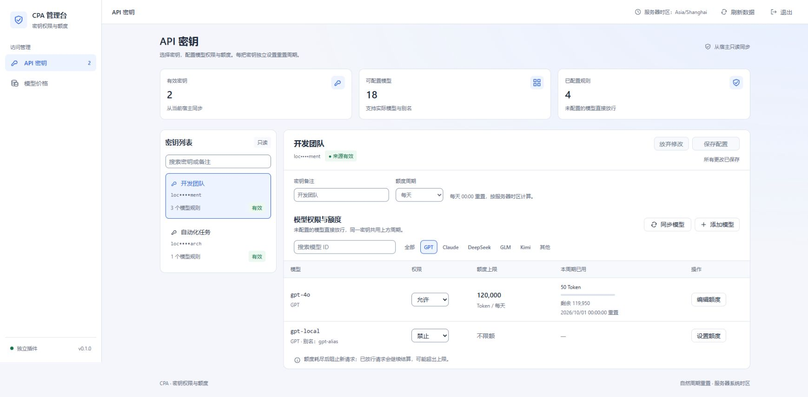
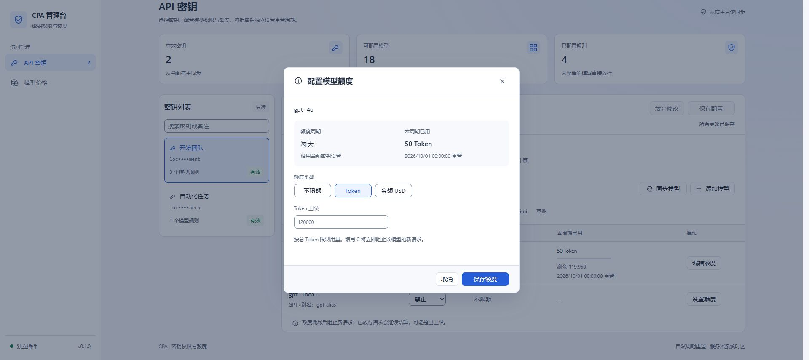
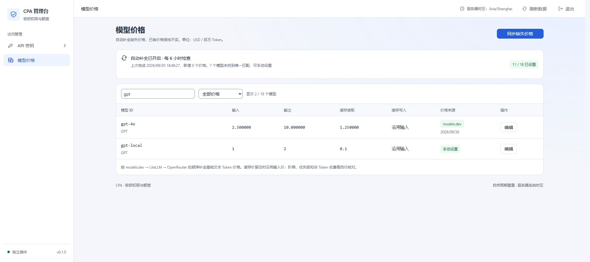

# 验证记录

验证日期：2026-10-09。

环境：Windows x64、Rust 1.95.0，服务器系统时区为 `Asia/Shanghai`。v0.1.0 基线使用 CLIProxyAPI v8.0.4 官方 Windows 二进制，宿主提交 `d33f63f8e3d98428440ebca5a5b6a981a61ff71e`。

所有模型推理使用本机模拟上游和临时密钥，没有调用收费模型，也未修改用户已有部署。基线价格目录同时进行了可控模拟和真实公开 GET 验证。以下分别记录新增功能和原有基线，基线宿主与浏览器结果不代表已对新版本重复验收。

## v0.3.1 内嵌页面与配置路径识别

- 页面资源 CSP 移除 `frame-ancestors 'none'`，覆盖宿主管理前端通过同源或跨来源 API 地址 iframe 内嵌的场景。
- `cpa-config-path` 为空时，插件从宿主进程参数识别 `-config path`、`--config path`、`-config=path` 和 `--config=path`；相对路径按宿主工作目录解析。
- 宿主未传配置参数时，插件使用宿主相同的默认规则：工作目录下的 `config.yaml`。
- 5 项 Rust 回归测试覆盖四种路径解析分支及同源 iframe CSP；同时执行完整 `cargo test --locked`、`cargo fmt --check`、JavaScript 语法检查和发布注册表校验。
- 外部配置存储等无法从宿主进程参数确定实际文件路径的部署，仍需显式设置 `cpa-config-path`。

## v0.3.0 总额度开关与渠道模式：20 项后台测试通过

执行 `cargo test --lib channel_mode_tests -- --test-threads=4`，20 passed、0 failed。测试使用隔离 SQLite 和假密钥，关闭价格同步，不发送模型推理请求：

1. 六个模型家族识别与命名空间前缀处理；自定义名称不因包含 gpt 字样误归属。
2. 旧策略自动保留模型模式，按旧总额度推导开关。
3. 总开关关闭、无规则时仍记录用量，重新开启沿用累计消耗。
4. 总额度为 0 的开关语义，包括无价格的金额范围。
5. 同渠道多模型和不同上游共享额度；重复通知及 TraceID 关联不重复计费。
6. 两种模式严格互斥，切换保留两套配置与账本。
7. 别名按实际模型归属，“其他”渠道可明确禁止。
8. 纯 Token 计数检查全部已知候选权限，不扣生成额度。
9. 总额与分项 Token／金额混合，金额按各模型价格汇总。
10. 暂停的模式规则、关闭的总金额不要求价格。
11. 生效渠道金额缺价返回中文拒绝，不创建待结算请求。
12. 重叠范围补价仅一次，策略与费用原子提交。
13. 未计价待结算请求仅阻止对应有效金额范围启用。
14. 待核对按有效范围拦截；人工结算与迟到修正保留渠道。
15. 无有效限额时历史待核对不阻塞，孤立用量回调不补造账本。
16. 密钥隔离、周期切换、重启及新周期汇总。
17. 非法模式、开关与上限冲突、未知渠道、非法额度和版本冲突。
18. 旧客户端 PUT 省略新字段时保留新配置。
19. schema 1 升级后 Token、费用、时间不变；重复启动不重复迁移。
20. 状态接口包含渠道、模式、持续记账时间和周期覆盖提示。

## v0.3.0 DOM 交互：12 项通过

加载实际 HTML／JavaScript，使用 jsdom 与内存 API 数据，12 passed、0 failed：

- 总开关草稿、关闭保留值、关闭时编辑不启用、重新开启不清空用量。
- 首次开启取消保持关闭，首次保存 0 正确显示耗尽。
- 六渠道表、模式保存后生效、切回恢复、编辑渠道不覆盖模型规则。
- 负数就地校验、单位输入独立、取消确认。
- 弹窗明确说明将提交的开关／模式草稿，补计费用要求确认。
- 未计价渠道不显示虚假费用，待核对请求带正确 channel 参数。

上述 20 项 Rust 测试与 12 项 DOM 测试是本轮临时验证，源码与 Rust 测试入口在验证后移除；不属于交付源码中持续保留的测试套件。

## v0.3.0 渐进式限制界面重构

后续按用户反馈将密钥详情改为按需添加限制。使用实际 HTML／JavaScript 和 jsdom 增加 7 项临时交互检查，全部通过：

1. 初始页面只显示已启用的总额度和已添加的当前模式规则，不铺开六个渠道或全部模型。
2. 关闭总额度后设置行立即收起，并说明配置仍保留。
3. 放弃开关草稿后恢复原有限制。
4. 添加弹窗提供全部模型、渠道、单个模型三种范围。
5. 新增渠道默认选择尚未配置的范围，避免覆盖已有额度。
6. 添加单模型限制会切换当前模式，保存模型规则，并提示原渠道规则保留但暂停。
7. 选择全部模型时隐藏权限和“不限额”，只显示总额度需要的字段。

最终 DLL 通过宿主配置热更新加载。真实浏览器确认现有策略只显示“全部模型”和已添加的 GPT 渠道两行；添加弹窗根据范围动态显示渠道、模型、权限和额度字段，切到单模型时显示模式切换提示。未提交弹窗草稿已放弃，没有修改演示策略。

## v0.3.0 官方宿主与真实页面

用户手动启动的本地演示宿主 CLIProxyAPI v8.0.4 保持运行。本轮先使用 SQLite backup API 备份数据库，再通过宿主自身的配置热更新加载 v0.3.0；日志明确显示 `plugin hot reloaded`，页面显示 v0.3.0。没有重新启动进程或绕过此前的启动限制。

已验证：

- 数据库 schema 升至 2，旧 48 条用量全部补充渠道。与升级前备份逐字段比较，原有用量无缺失，Token、费用、时间和明细均未改变。
- 真实浏览器登录，管理 API 保存与刷新正常。
- 首次开启总额度，保存 100,000 Token 后显示历史已用 250 Token；关闭隐藏余额，重新开启仍为 250 Token。
- 切换按渠道并设置 GPT 为 50,000 Token，显示跨 GPT 模型已用 100 Token。
- 切回模型恢复 gpt-4o 的 100,000 Token／已用 50 Token、Claude 的金额规则与 gpt-local 禁止规则；切回渠道仍保留 GPT 上限及用量。
- 渠道成员展开可用，额度弹窗保存后焦点返回原渠道按钮。
- 桌面页面及 390px 窄屏检查：页面无整页横向溢出，表格在内部横向滚动；窄屏总额度弹窗完整显示输入和底部操作，取消后焦点恢复。

演示实例无模型上游凭据，本轮未重新验证真实宿主中的推理、流式结算和渠道拒绝请求完整链路。这些新增逻辑目前由上述隔离后台测试覆盖，旧版推理验收不能替代本版完整链路验收。

## v0.2.0 总额度：17 项逻辑测试通过

执行 `cargo test --lib total_quota_tests -- --test-threads=4`，17 passed、0 failed。测试使用隔离 SQLite、临时密钥和固定时间，关闭价格同步，不启动宿主或模型服务：

1. 旧策略缺少总额度时保持兼容，不自动启用总限制。
2. 总 Token 合并多个模型、新模型及别名；重复用量通知只记一次。
3. 总额度和单模型额度共同生效，分别返回 `scope=total`／`scope=model`，不重复记账。
4. 移除总额度保留历史用量和单模型额度；未准入的旧请求回调不补造总用量。
5. 密钥之间隔离，总 Token 为 0 时拦截所有模型。
6. 总额度不覆盖模型禁止规则，别名不能绕过禁止。
7. 总金额按各模型不同价格合计，已放行请求保留价格快照。
8. 总 Token＋单模型金额、总金额＋单模型 Token 均独立判断。
9. 总金额缺少当前模型价格时返回 503，不创建待结算请求。
10. 总金额为 0 时，即使新模型尚未定价，也返回总额度耗尽的 429。
11. 启用总金额前预览并确认跨模型补计；与单模型金额重叠的用量只补计一次。
12. 历史模型缺价时拒绝保存，不发生部分补计或策略更新。
13. 未计价执行中请求阻止切换为总金额，避免漏计。
14. 任一模型待核对时暂停该密钥的总额度调用；密钥级查询与人工核对可恢复调用。
15. 周期切换和重启保留共享账本，新自然周期重新汇总。
16. 非法总额度、未知单位及过期策略版本被拒绝。
17. 状态接口分别返回总用量和单模型用量，重置时间一致。

## v0.2.0 页面 DOM：12 项通过

使用 Node.js v22.22.2 和临时 jsdom 26.1.0 加载实际 `ui/index.html`、`ui/app.js`，接口由测试内存数据提供；没有连接真实宿主：

1. 显示总上限、跨模型合计与余额；未单独限额模型标注总额度限制。
2. 负数额度显示字段附近的中文错误并阻止保存。
3. 总 Token 一次保存，保留单模型额度和原有用量。
4. Token／金额分别保留输入；切换总金额后正确显示费用与余额。
5. 修改单模型额度保留总额度。
6. 删除总额度保留单模型规则。
7. 未保存弹窗取消需要确认，继续保留输入，放弃不写入策略。
8. 总额度 0 显示全部模型耗尽；其他密钥草稿在明确提示后一起保存。
9. 修改周期显示保存后计算，放弃后恢复已保存周期。
10. 未计价时不显示虚假余额；展示待结算数量，核对入口查询整个密钥。
11. 总金额保留缺价提示；历史补价要求明确勾选确认，成功后刷新合计。
12. 单模型金额额度继续要求先设置该模型价格。

DOM 测试仅验证状态与交互逻辑，不验证浏览器布局、原生对话框行为或宿主集成。本轮本地宿主启动被执行策略拒绝，内置浏览器也拒绝本地 `file://` 页面；没有绕过限制。v0.2.0 未完成真实宿主及浏览器布局验收，没有新增截图。

上述临时 Rust／DOM 测试源码及入口在验证后移除，不是交付源码中的保留测试目标。

## v0.1.0 基线核心逻辑：11 项通过

执行 `cargo test --lib core_revision_tests`，11 passed、0 failed：

1. 未配置模型直接放行，不产生额度请求与用量记录。
2. 显式禁止保护实际模型和别名，其他密钥／未配置模型独立。
3. 不同密钥的周期隔离，切换周期保留账本。
4. 零额度的中文拒绝和服务器时区，忽略旧时区设置。
5. 旧默认权限／逐模型周期迁移，以及拒绝新提交中的逐模型周期。
6. 系统时区自然日、周一、月初边界，以及纽约夏令时 23／25 小时日。
7. 移除设置和用量明细路由，保留异常核对并添加价格同步路由。
8. 十进制价格、科学记数法、明确零值、非法数值和精度转换。
9. models.dev 官方模型身份优先，避免误用转售商价格。
10. 歧义、缺价、无效价格和非文本条目不被当作免费。
11. LiteLLM / OpenRouter 缓存映射和零价格保留。

测试完成后删除了临时测试源文件及入口，此命令不是交付源码中的保留测试目标。

## v0.1.0 基线官方宿主：13 项通过

将业务逻辑修改后的 release DLL 加载进官方宿主：

1. 启动自动补价、官方来源优先、LiteLLM / OpenRouter 两级回退、实际模型与别名共用价格。
2. 阻塞价格源响应期间管理接口仍可用；并发手动零价格及已有价格不被覆盖。
3. 歧义和缺失模型保持未设置。
4. 新增模型自动触发补价。
5. 重复同步不修改已有自动价格和版本。
6. 全部来源失败仍保留有效价格，显示中文状态。
7. 密钥可分别使用不同周期，时区来自服务器，没有默认模型权限字段。
8. 明确禁止的别名被拦截，未配置模型正常放行。
9. 50 Token 额度正常记账、耗尽返回中文 429，后续请求不进入上游。
10. 另一把密钥独立；20 个并发流式／非流式请求产生 20 条用量记录，共 1000 Token。
11. 日周期改为月周期后保留 50 Token；Responses、Anthropic Messages 请求仍能通过宿主转换。
12. 旧设置、用量页面与路由移除，对应 API 返回 404。
13. 发布 DLL 从真实 models.dev 公开目录自动获取并补全 gpt-4o，来源模型为 `openai/gpt-4o`。

本轮包含 25 次本地模拟上游请求。模拟价格源记录 9 次目录 GET，无 Authorization 或客户端密钥参数。真实公开目录补价不调用模型。

随后仅调整管理页面。最终 DLL 再次在同一官方宿主中加载，检查注册、管理接口鉴权（无密钥返回 401）、三项嵌入静态资源，并通过以下浏览器验收。

## v0.1.0 基线浏览器交互与布局

使用 Chrome 访问真实宿主插件路由，验证：

- 只有 API 密钥、模型价格两个导航入口；按密钥修改周期后，已有 50 Token 保留，另一把密钥仍使用独立每周周期。
- 表格展示额度摘要，没有额度单位下拉框和数值输入框。点击“编辑额度”打开集中编辑弹窗，修改为 120000 Token 后一次保存生效，已用仍为 50 Token。
- 原生额度类型单选支持方向键；切到金额时输入为空，输入金额后切回 Token 恢复原 Token 数值。
- 非法负数显示字段附近的中文错误并阻止保存；未保存输入取消时要求确认，确认放弃后保存值不变。
- 价格名称筛选、无结果提示、清除筛选、手动价格编辑与保存正常。同步状态、来源与覆盖数量可见。
- 弹窗打开后背景滚动为 `hidden`，标题与操作区保留；按钮处理中状态可见。
- 页面正文 14px；桌面内容最大 1440px。权限框 88×32px、周期框 112×32px、备注和额度输入 224×32px、价格输入 224×32px，所有短字段不超过 300px。
- 390×844 窄屏下页面内容宽 375px（预留滚动条），无页面级横向溢出。模型／价格表格分别在 341px 容器内横向滚动。
- 窄屏额度弹窗宽 341px，上下边界在视口内；保存按钮宽 112px、高 32px，完整可见。窄屏保持 14px 正文。
- 语义颜色的正常文字／状态对比度为 4.66～14.24；输入边框与白色背景对比度为 3.19。辅助正文对比度为 5.35。
- 浏览器控制台未发现警告或错误。

截图为 v0.1.0 基线的本地验收数据，包含测试模型；尚不包含 v0.2.0 总额度区域：







## 构建与边界

`cargo check`、`cargo fmt --check`、`node --check ui/app.js`、`cargo build --release --locked` 均通过。安装包脚本会复制上述 DLL、说明、配置示例、截图和验证记录，并生成 SHA-256 校验文件。

本轮页面交互验收时的 Windows x64 DLL SHA-256（配置 GitHub 发布元数据之前的本地构建）：

```text
8bb95d5801d843e96c120bf76c9634cc1d2629b30e45b92a1a11429e6f5c4509
```

GitHub 发布构建包含仓库元数据，其文件哈希会变化。下载版本以对应 Release 的 `checksums.txt` 和 ZIP 内的 `SHA256SUMS.txt` 为准；各平台自动构建结果见仓库 Actions。自动编译通过不代表已在对应平台完成宿主功能验收。

当前工具链未安装 Clippy。未在 Linux／macOS、生产部署、收费上游、Responses WebSocket、多宿主共享数据库下验收，也未进行性能或长时间压力测试。

额度按已结算用量阻止后续请求。20 并发检查证明本轮用量记账完整，不代表消费绝不超额。
